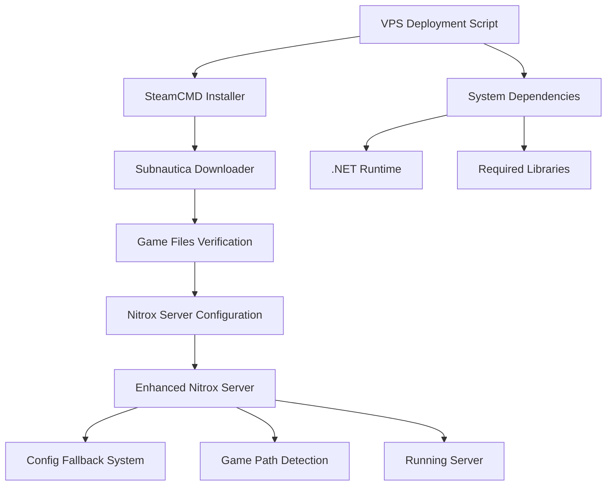

# Design Document

## Overview

This design implements a fully automated VPS deployment solution for Nitrox multiplayer server that eliminates Docker dependencies and manual configuration. The solution consists of three main components: an automated SteamCMD installation system, a Subnautica download manager, and enhanced Nitrox server code that handles VPS environment constraints.

The design addresses the core issues where Nitrox server crashes due to missing desktop environment variables (HOME, XDG_CONFIG_HOME) and inability to locate Subnautica game files without Steam/Epic launchers installed.

## Architecture

### High-Level Architecture



### Component Interaction Flow

1. **Deployment Script** orchestrates the entire installation process
2. **SteamCMD Installer** downloads and configures Steam for headless operation
3. **Subnautica Downloader** uses SteamCMD to download game files
4. **Enhanced Nitrox Server** starts with fallback mechanisms for VPS environment

## Components and Interfaces

### 1. VPS Deployment Script (`install-vps.sh`)

**Purpose**: Single entry point that automates the entire deployment process

**Interface**:
```bash
./install-vps.sh [OPTIONS]
  --steam-user <username>     # Steam username (required)
  --steam-pass <password>     # Steam password (required)  
  --install-dir <path>        # Installation directory (default: /opt/nitrox)
  --server-name <name>        # Server name (default: "Nitrox VPS Server")
  --admin-password <pass>     # Admin password (required)
  --server-password <pass>    # Server password (optional)
  --max-players <number>      # Max players (default: 100)
```

**Responsibilities**:
- Detect Linux distribution and install appropriate packages
- Install .NET runtime and dependencies
- Download and configure SteamCMD
- Execute Subnautica download process
- Configure Nitrox server settings
- Apply code patches for VPS compatibility
- Start the server and verify operation

### 2. SteamCMD Installation Manager

**Purpose**: Handles SteamCMD installation and configuration for headless operation

**Key Functions**:
```bash
install_steamcmd() {
    # Download SteamCMD for Linux
    # Extract to /opt/steamcmd
    # Set proper permissions
    # Verify installation
}

configure_steamcmd() {
    # Create steamcmd user if needed
    # Set up directory structure
    # Configure for headless operation
}
```

**Dependencies**:
- `lib32gcc1` (32-bit compatibility)
- `lib32stdc++6`
- `curl` or `wget`

### 3. Subnautica Download Manager

**Purpose**: Downloads Subnautica using SteamCMD with robust error handling

**Key Functions**:
```bash
download_subnautica() {
    local steam_user="$1"
    local steam_pass="$2" 
    local install_dir="$3"
    
    # Create SteamCMD script
    # Execute download with retry logic
    # Verify download integrity
    # Set proper permissions
}

verify_game_files() {
    # Check for Subnautica.exe
    # Verify Subnautica_Data directory
    # Validate critical assemblies
    # Calculate and log download size
}
```

**Configuration**:
- Subnautica Steam App ID: `264710`
- Retry attempts: 3 with exponential backoff
- Timeout: 30 minutes per attempt

### 4. Enhanced Nitrox Server Code

**Purpose**: Modify existing Nitrox server to handle VPS environment constraints

#### 4.1 Configuration Path Fallback System

**File**: `NitroxModel/Platforms/OS/Shared/ConfigFileKeyValueStore.cs` (estimated location)

**Current Issue**: Code crashes when HOME/XDG_CONFIG_HOME environment variables are missing

**Enhanced Logic**:
```csharp
private string GetConfigurationPath()
{
    try 
    {
        // Try existing system path detection
        string systemPath = Environment.GetFolderPath(Environment.SpecialFolder.ApplicationData);
        if (!string.IsNullOrEmpty(systemPath) && Directory.Exists(Path.GetDirectoryName(systemPath)))
        {
            return systemPath;
        }
        
        // Try XDG_CONFIG_HOME
        string xdgPath = Environment.GetEnvironmentVariable("XDG_CONFIG_HOME");
        if (!string.IsNullOrEmpty(xdgPath) && Directory.Exists(xdgPath))
        {
            return Path.Combine(xdgPath, "Nitrox");
        }
        
        // Try HOME/.config
        string homePath = Environment.GetEnvironmentVariable("HOME");
        if (!string.IsNullOrEmpty(homePath))
        {
            string configPath = Path.Combine(homePath, ".config", "Nitrox");
            return configPath;
        }
        
        throw new DirectoryNotFoundException("No system configuration path available");
    }
    catch (Exception ex)
    {
        // FALLBACK: Use local directory
        string fallbackPath = Path.Combine(AppContext.BaseDirectory, "UserData", "Config");
        Directory.CreateDirectory(fallbackPath);
        
        // Log the fallback usage
        Console.WriteLine($"Using fallback configuration path: {fallbackPath}");
        Console.WriteLine($"Reason: {ex.Message}");
        
        return fallbackPath;
    }
}
```

#### 4.2 Game Installation Detection Enhancement

**File**: `NitroxModel/Discovery/GameInstallationFinder.cs` (estimated location)

**Current Issue**: Only searches for Steam/Epic installations, fails on VPS

**Enhanced Logic**:
```csharp
public string FindGameInstallationPath()
{
    // PRIORITY 1: Check for manual configuration file
    string manualConfigPath = Path.Combine(AppContext.BaseDirectory, "subnautica_path.txt");
    if (File.Exists(manualConfigPath))
    {
        string configuredPath = File.ReadAllText(manualConfigPath).Trim();
        if (ValidateGameInstallation(configuredPath))
        {
            Console.WriteLine($"Using manually configured game path: {configuredPath}");
            return configuredPath;
        }
        else
        {
            Console.WriteLine($"WARNING: Configured path invalid: {configuredPath}");
        }
    }
    
    // PRIORITY 2: Check common VPS installation paths
    string[] vpsCommonPaths = {
        "/opt/subnautica",
        "/home/steam/subnautica", 
        Path.Combine(AppContext.BaseDirectory, "gamefiles"),
        "/usr/local/games/subnautica"
    };
    
    foreach (string path in vpsCommonPaths)
    {
        if (ValidateGameInstallation(path))
        {
            Console.WriteLine($"Found game installation at: {path}");
            return path;
        }
    }
    
    // PRIORITY 3: Existing Steam/Epic detection (for desktop compatibility)
    return FindGameInstallationLegacy();
}

private bool ValidateGameInstallation(string path)
{
    if (!Directory.Exists(path)) return false;
    
    // Check for essential files
    string[] requiredFiles = {
        "Subnautica.exe",
        "Subnautica_Data/Managed/Assembly-CSharp.dll",
        "Subnautica_Data/StreamingAssets"
    };
    
    return requiredFiles.All(file => 
        File.Exists(Path.Combine(path, file)) || 
        Directory.Exists(Path.Combine(path, file))
    );
}
```

### 5. Configuration Management System

**Purpose**: Generate and manage server configuration files automatically

**Configuration Template**:
```json
{
    "ServerName": "${SERVER_NAME}",
    "ServerPort": 11000,
    "ServerPassword": "${SERVER_PASSWORD}",
    "AdminPassword": "${ADMIN_PASSWORD}",
    "GameMode": "Survival",
    "MaxPlayers": ${MAX_PLAYERS},
    "SaveInterval": 300000,
    "GameInstallationPath": "${GAME_PATH}",
    "ConfigurationPath": "${CONFIG_PATH}"
}
```

## Data Models

### Installation Configuration
```bash
# Environment variables for deployment
STEAM_USERNAME=""           # Steam account username
STEAM_PASSWORD=""           # Steam account password  
NITROX_INSTALL_DIR=""      # Base installation directory
NITROX_SERVER_NAME=""      # Display name for server
NITROX_ADMIN_PASSWORD=""   # Administrator password
NITROX_SERVER_PASSWORD=""  # Optional server password
NITROX_MAX_PLAYERS=""      # Maximum concurrent players
SUBNAUTICA_INSTALL_DIR=""  # Game files location
```

### Directory Structure
```
/opt/nitrox/                    # Base installation
├── steamcmd/                   # SteamCMD installation
├── gamefiles/                  # Subnautica game files
├── server/                     # Nitrox server binaries
│   ├── UserData/              # Fallback config directory
│   │   └── Config/            # Configuration files
│   ├── Saves/                 # World save files
│   └── Logs/                  # Server logs
├── subnautica_path.txt        # Manual game path config
└── install-vps.sh             # Installation script
```

## Error Handling

### Steam Authentication Failures
- **Retry Logic**: 3 attempts with 30-second delays
- **Error Messages**: Clear indication of authentication vs. network issues
- **Fallback**: Option to use different Steam account

### Download Interruptions
- **Resume Support**: SteamCMD native resume capability
- **Integrity Verification**: Post-download file validation
- **Cleanup**: Remove partial downloads on failure

### Permission Issues
- **User Detection**: Automatic detection of current user context
- **Directory Creation**: Recursive creation with proper permissions
- **Ownership**: Set appropriate ownership for service accounts

### Configuration Failures
- **Validation**: Pre-flight checks for all configuration values
- **Defaults**: Sensible defaults for optional parameters
- **Recovery**: Automatic regeneration of corrupted config files

## Testing Strategy

### Unit Tests
- **Configuration Path Resolution**: Test all fallback scenarios
- **Game Path Detection**: Validate detection logic with mock directories
- **File Validation**: Test game installation validation logic

### Integration Tests
- **SteamCMD Integration**: Test download process with test Steam account
- **Server Startup**: Verify server starts with generated configuration
- **Client Connection**: Test multiplayer connection functionality

### System Tests
- **Full Deployment**: End-to-end deployment on clean VPS
- **Multiple Distributions**: Test on Ubuntu, Debian, CentOS
- **Resource Constraints**: Test with limited RAM/disk scenarios

### Performance Tests
- **Download Speed**: Measure download performance across regions
- **Server Performance**: Baseline performance metrics
- **Memory Usage**: Monitor memory consumption patterns

## Security Considerations

### Credential Management
- **Steam Credentials**: Secure handling during installation, no persistence
- **Admin Passwords**: Strong password requirements and validation
- **File Permissions**: Restrictive permissions on configuration files

### Network Security
- **Firewall Configuration**: Automatic firewall rules for required ports
- **Port Management**: Configurable ports with validation
- **Access Control**: Optional IP-based access restrictions

### System Security
- **User Isolation**: Run server as dedicated user account
- **Directory Permissions**: Minimal required permissions
- **Log Security**: Secure log file handling and rotation